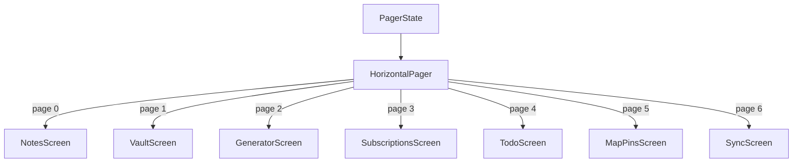

# Android app

The Android app is the mobile counterpart to the [Chrome extension](./chrome-extension.md). It is a single-activity Jetpack Compose application that stores everything locally in a Room database and encrypts secrets with the Android Keystore. There is no backend server; sync flows through Google Drive `appDataFolder`, same as the extension.

## Compose UI

The entire UI is declarative Compose. There is no XML layout, no Fragment, no Navigation component. The app is a single `ComponentActivity` (`android/app/src/main/java/com/myspace/app/MainActivity.kt`) that swaps between a splash composable and the main app composable based on a `showSplash` boolean held in `remember` state:

```kotlin
setContent {
    MySpaceTheme {
        var showSplash by remember { mutableStateOf(true) }
        if (showSplash) {
            SplashScreen(onFinished = { showSplash = false })
        } else {
            MySpaceApp()
        }
    }
}
```

`enableEdgeToEdge()` is called so content draws behind system bars; the top and bottom bars apply `statusBarsPadding()` and `navigationBarsPadding()` respectively to avoid overlap.

The database is obtained via `AppDatabase.get(context)` (a singleton) and passed down to each screen composable. Each screen owns its own coroutine scope and DAO calls; there is no shared ViewModel layer.

## HorizontalPager navigation

`MySpaceApp` (`android/app/src/main/java/com/myspace/app/ui/MySpaceApp.kt`) uses `HorizontalPager` as its navigation primitive instead of a bottom navigation bar with destinations. Seven screens are declared as a sealed `Screen` hierarchy:

| Screen     | Route  | Label      | Accent colour     |
|------------|--------|------------|-------------------|
| `Notes`    | notes  | Notes      | `AccentNotes` indigo  |
| `Vault`    | vault  | Vault      | `AccentVault` amber   |
| `Generator`| gen    | Generator  | `AccentGen` violet    |
| `Subs`     | subs   | Subs       | `AccentSubs` emerald  |
| `Todo`     | todo   | To-Do      | `AccentTodo` sky      |
| `MapPins`  | maps   | Map Pins   | `AccentMaps` orange   |
| `Sync`     | sync   | Sync       | `AccentSync` blue     |

`allScreens` is the ordered list. `rememberPagerState(initialPage = 0) { allScreens.size }` fixes the page count. The pager is configured with `beyondViewportPageCount = 1` so adjacent pages stay composed for smooth swipe transitions.



### Page indicator

The bottom bar is a custom `PagerIndicator` composable: a row of dots where the selected page's dot expands into a 24dp pill (animated via `animateDpAsState`) and takes the current screen's accent colour. Tapping a dot calls `pagerState.animateScrollToPage(page)` within a `rememberCoroutineScope`.

### Top bar

A translucent top bar (`Color(0xCC0A0E17)`) shows the `SpaceLogo` composable on the left and a pill with the current screen's label and accent colour on the right. The `SpaceLogo` draws a shield icon programmatically via `drawBehind { drawShield(this) }` rather than using a vector asset, so it matches the splash screen's shield exactly.

### Glow

Each page's background gets a vertical gradient glow at the top, coloured by the current screen's accent at 10% alpha, animated over 400ms via `animateColorAsState`. This mirrors the radial glow effect in the Chrome extension's side panel.

## Splash screen

`SplashScreen` (`android/app/src/main/java/com/myspace/app/ui/screens/SplashScreen.kt`) is a fully custom Compose animation, not the AndroidX core splash screen API (that is installed in `MainActivity` via `installSplashScreen()` purely to satisfy the system splash requirement before Compose mounts).

The splash runs for 2200ms (`delay(2200)` in a `LaunchedEffect`) then calls `onFinished`. During that time it plays three layered animations:

1. **Shield entry** — the shield scales from 0.6 to 1.0 with a medium-bouncy spring and fades in over 600ms.
2. **Glow breathe** — an infinite `rememberInfiniteTransition` pulses a radial gradient around the shield between 0.80 and 1.25 radius and 0.30 to 0.55 alpha, reversing every 1800ms.
3. **Pulse rings** — three concentric stroke rings expand outward and fade, staggered by 500ms each (0ms, 500ms, 1000 offsets), repeating every 1600ms.

The wordmark ("My" / "SPACE" stacked) fades in after a 250ms delay. The shield itself is drawn with a private `drawSplashShield` function that paints the same shield silhouette as the top-bar logo but larger and with a keyhole detail.

## Dark theme with accent colours

The theme (`android/app/src/main/java/com/myspace/app/ui/theme/Theme.kt`) is a single `darkColorScheme`. There is no light theme. The palette is tuned for the deep navy background `#0A0E17`:

| Token           | Value       | Purpose                         |
|-----------------|-------------|---------------------------------|
| `BgDeep`        | `#0A0E17`   | App background                  |
| `BgCard`        | `#131929`   | Card / surface base             |
| `BgCardBorder`  | `#1E2A3A`   | Card outline                    |
| `GlassBg`       | white 10%   | Glass panel fill                |
| `GlassBorder`   | white 15%   | Glass panel border              |
| `AccentNotes`   | `#818CF8`   | indigo-400                      |
| `AccentVault`   | `#FBBF24`   | amber-400                       |
| `AccentSync`    | `#60A5FA`   | blue-400                        |
| `AccentGen`     | `#C4B5FD`   | violet-300                      |
| `AccentSubs`    | `#34D399`   | emerald-400                     |
| `AccentReport`  | `#F472B6`   | pink-400                        |
| `AccentTodo`    | `#38BDF8`   | sky-400                         |
| `AccentMaps`    | `#FB923C`   | orange-400                      |
| `TextPrimary`   | white 94%   | Primary text                    |
| `TextSecondary` | white 67%   | Secondary text                  |
| `TextMuted`     | white 40%   | Muted text                      |

The accent colours are deliberately the same hue family as the Chrome extension's icon rail so the two platforms feel like one product.

### Typography

`Typography.kt` defines a compact set of Material 3 text styles using `FontFamily.Default`. Letter spacing is slightly negative for display/headline styles (`-0.5sp` to `--0.1sp`) to keep the wordmark tight, and slightly positive for label styles (`0.2sp`-`0.3sp`) for readability at small sizes. Line heights are generous relative to font size (e.g. `bodyLarge` 15sp / 22sp) to suit the dark background.

## OAuth redirect handling

The `AndroidManifest.xml` (`android/app/src/main/AndroidManifest.xml`) registers a custom-scheme intent filter on `MainActivity` for the OAuth callback:

```xml
<intent-filter>
    <action android:name="android.intent.action.VIEW" />
    <category android:name="android.intent.category.DEFAULT" />
    <category android:name="android.intent.category.BROWSABLE" />
    <data android:scheme="com.myspace.app" android:host="oauth2callback" />
</intent-filter>
```

This means after the system browser completes the Google OAuth consent flow, it redirects to `com.myspace.app://oauth2callback?code=...`, which Android routes back to `MainActivity`. The sync screen (`SyncScreen`) reads the auth code from the intent and exchanges it for a Drive access token. This avoids embedding a WebView and keeps the OAuth flow in the user's preferred browser.

### Permissions

The manifest declares three permissions:

- `INTERNET` — Drive API calls.
- `USE_BIOMETRIC` and `USE_FINGERPRINT` — reserved for future biometric vault unlock (the current `CryptoManager` does not require user authentication, see [cryptography](../systems/crypto.md)).

`allowBackup` is set to `false` so the encrypted database is never included in cloud backups or device-to-device transfers.

## Related pages

- [Chrome extension](./chrome-extension.md) — the desktop counterpart with the same feature set.
- [Database](../systems/database.md) — Room schema, 8 entities, 6 migrations v1 to v7.
- [Cryptography](../systems/crypto.md) — Android Keystore AES-GCM vs Web Crypto PBKDF2.
- [Security](../security.md) — OAuth scope minimisation, no-servers architecture.
- [Data models](../reference/data-models.md) — field-by-field comparison of Chrome vs Android entities.
