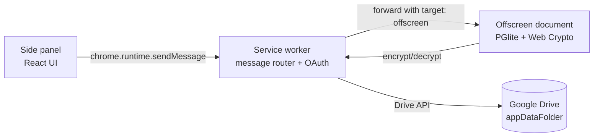

# Chrome extension

The Chrome extension is the primary surface for My SPACE on desktop. It is a Manifest V3 extension built with React 19, Vite, and Tailwind CSS v4, bundled via `@crxjs/vite-plugin`. The UI lives in a side panel, while all database and crypto work happens in an offscreen document that the service worker spins up on demand.

## Manifest V3 architecture

The manifest (`chrome-extension/manifest.json`) declares three execution contexts that cooperate at runtime:



Key manifest fields:

- **`background.service_worker`** — `src/service-worker/index.ts`, type `module`. This is the message router and OAuth broker. It owns no database state itself.
- **`side_panel.default_path`** — `src/sidepanel/index.html`. The React app mounts here.
- **`offscreen` permission** — required to create the offscreen document that hosts PGlite (WASM) and the Web Crypto key material. Service workers cannot use WASM or keep long-lived crypto state, so this indirection is mandatory under MV3.
- **`identity` permission** — used for `chrome.identity.getAuthToken` to obtain Google Drive OAuth tokens.
- **`sidePanel` permission** — required to open the side panel programmatically.
- **`activeTab`** — supports the map-pin capture flow from content scripts.
- **`content_security_policy`** — `script-src 'self' 'wasm-unsafe-eval'; object-src 'self'`. The `wasm-unsafe-eval` directive is required for PGlite's WASM module. No remote scripts are allowed.

### Build

The Vite config (`chrome-extension/vite.config.ts`) chains three plugins: `@vitejs/plugin-react`, `@tailwindcss/vite`, and `crx({ manifest })`. The `crx` plugin reads `manifest.json` and produces the extension bundle. A notable hack: `define: { 'process': JSON.stringify({...}) }` replaces the entire `process` global because PGlite's Emscripten layer references `process` dynamically and the browser has no such global. Tests run under `environment: 'node'` so they keep the real `process`.

The offscreen document is listed as an additional Rollup input (`src/offscreen/index.html`) so it gets its own HTML chunk in the build output.

## Side panel setup

The side panel's entry HTML is `src/sidepanel/index.html`, which loads `App.tsx`. The root component (`chrome-extension/src/sidepanel/App.tsx`) is the single source of truth for three pieces of UI state:

1. `view` — the currently active view (`View` union from `IconRail`).
2. `vaultLocked` — whether the vault key is currently materialised in the offscreen document.
3. `hasPassword` — `null` while checking, `false` if no master password has been set up, `true` once a salt exists in `chrome.storage.local`.

On mount, `App` does two things in parallel:

- Reads `vaultSalt` from `chrome.storage.local` to determine whether first-time setup is needed.
- Sends a `VAULT_STATUS` message to the service worker (forwarded to offscreen) to learn whether the vault is currently locked.

It also polls `VAULT_STATUS` every 5 seconds. This catches the case where the offscreen document's internal auto-lock timer fires independently, dropping the key without the side panel knowing.

### Message helper

Every view receives a `sendMsg` function prop rather than calling `chrome.runtime.sendMessage` directly:

```ts
export async function sendMsg(type, payload?) {
  const res = await chrome.runtime.sendMessage({ type, payload })
  return res ?? { ok: false, error: 'No response from service worker' }
}
```

This returns the standard `Reply` shape (`{ ok, data?, error? }`) defined in the [message protocol](../systems/message-protocol.md).

## Icon rail navigation

The icon rail (`chrome-extension/src/sidepanel/components/IconRail.tsx`) is a 48px-wide vertical bar on the left edge of the side panel. It defines the `View` type used throughout the app:

```ts
type View = 'notes' | 'keyvault' | 'generator' | 'subscriptions'
          | 'reports' | 'sync' | 'settings' | 'mapPins' | 'todo'
```

The rail is split into two groups:

- **Top items** (primary features): `notes`, `keyvault`, `generator`, `subscriptions`, `mapPins`, `todo`. Each has its own accent colour (`#818cf8` indigo, `#f59e0b` amber, `#a78bfa` violet, `#34d399` emerald, `#fb923c` orange, `#38bdf8` sky).
- **Bottom items** (pinned to the rail's bottom): `sync`, `settings`, both using blue `#60a5fa`.

The active button gets a translucent background (`${accent}22`) and a soft box-shadow glow (`0 0 12px ${accent}44`). The `reports` view is not in the rail; it is reached from within `SubscriptionsView` via `onGoReports`.

## View routing

`App` renders the active view with a chain of conditional `&&` blocks:

| View         | Component              | Gated? |
|--------------|------------------------|--------|
| `notes`      | `NotesView`            | yes    |
| `keyvault`   | `KeyvaultView`         | yes    |
| `generator`  | `GeneratorView`        | no     |
| `subscriptions` | `SubscriptionsView` | yes    |
| `reports`    | `ReportsView`          | yes    |
| `sync`       | `SyncView`             | yes    |
| `settings`   | `SettingsView`         | yes    |
| `mapPins`    | `MapPinsView`          | yes    |
| `todo`       | `TodoView`             | no     |

`GATED_VIEWS` is the list of views that require an unlocked vault: `['notes', 'keyvault', 'subscriptions', 'reports', 'sync', 'settings', 'mapPins']`. The `todo` and `generator` views are intentionally **not gated** so users can access them without unlocking the vault (quick capture use case).

When the active view is gated and the vault is locked, `App` renders `LockScreen` instead of the view component. Each view also receives a per-view radial glow via the `glows` map, painted as a non-interactive absolute layer behind the content.

## Vault lock/unlock flow

The flow is driven entirely from `App.tsx` and lives across three screens:

### Setup screen (first run)

Shown when `hasPassword === false` (no `vaultSalt` in local storage). The user enters and confirms a password (minimum 8 characters). On submit:

1. Generate a 16-byte random salt via `crypto.getRandomValues`.
2. Store the salt array in `chrome.storage.local` under `vaultSalt`.
3. Send `VAULT_UNLOCK` with the password and salt. The offscreen document derives the AES-GCM key (see [cryptography](../systems/crypto.md)) and holds it in memory.
4. On success, flip `hasPassword` to `true` and `vaultLocked` to `false`.

### Lock screen (returning user, vault locked)

Shown when a gated view is active but `vaultLocked` is `true`. The user enters their master password, which is sent with the stored salt to `VAULT_UNLOCK`. On success the view content replaces the lock screen.

### Manual lock

`KeyvaultView` and `SettingsView` both receive an `onLock` callback that sets `vaultLocked` back to `true`. They also send `VAULT_LOCK` to the service worker, which forwards it to the offscreen document to zero the key.

## Idle auto-lock

The `useIdleLock` hook (`App.tsx`) implements a client-side idle timer that complements the offscreen document's own timer (see [cryptography](../systems/crypto.md)). When the vault is unlocked:

- It reads `autoLockMs` from `chrome.storage.local` (default 15 minutes). A value of `0` disables the timer.
- It schedules a `setTimeout` that sends `VAULT_LOCK` and calls `onLock()`.
- Any `mousemove` or `keydown` event in the side panel document resets the timer.

When the vault is locked, the hook tears down its listeners and clears the pending timer. This is a belt-and-suspenders approach: even if the offscreen document's own timer fails (e.g. the document was recreated), the side panel will still lock after the configured idle period.

## Styling

Global styles live in `chrome-extension/src/sidepanel/index.css`. It imports Tailwind v4 and defines CSS custom properties for the dark theme:

- `--bg-base: #0d1117` (GitHub dark canvas)
- Glass surfaces: `--glass-bg: rgba(255,255,255,0.06)`, `--glass-border: rgba(255,255,255,0.08)`
- Per-feature accents: notes indigo, vault amber, sync blue

The `.glass-card` class applies the glass background, border, and a `backdrop-filter: blur(10px)`. The `.prose-dark` class family styles rendered markdown previews (headings, code blocks, lists, links) with dark-appropriate colours. See [security](../security.md) for how the markdown renderer sanitises input before this CSS is applied.

## Related pages

- [Message protocol](../systems/message-protocol.md) — the typed message system that connects side panel, service worker, and offscreen.
- [Cryptography](../systems/crypto.md) — PBKDF2 key derivation, AES-GCM encrypt/decrypt, auto-lock timer.
- [Database](../systems/database.md) — PGlite schema and the 8 tables behind these views.
- [Security](../security.md) — CSP, XSS sanitisation, OAuth scope minimisation.
- [Android app](./android-app.md) — the mobile counterpart.
