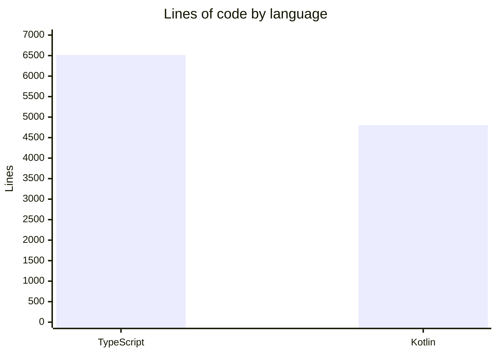

# By the numbers

A quantitative snapshot of the My SPACE repository. All figures were collected on **2025-06-30** from the working tree at `/Users/cuongquachc/Projects/poc/my-space`.

## Headline figures

| Metric | Value |
|---|---|
| Total commits | 83 |
| Commits since 2025-03-01 | 83 |
| Contributors | 1 |
| Source files (TS/TSX + Kotlin) | 50 |
| Test files (Vitest) | 12 |
| Lines of TypeScript (Chrome extension) | ~6,515 |
| Lines of Kotlin (Android app) | ~4,803 |
| Total source lines | ~11,318 |

The project is a solo effort: a single contributor has produced all 83 commits, every one of them landing on or after 2025-06-09. Despite that, the codebase already spans two platforms (Chrome MV3 extension and a Jetpack Compose Android app) with a real test suite on the extension side.

## Source files by language

| Language | Files | Lines |
|---|---|---|
| TypeScript / TSX | 33 | ~6,515 |
| Kotlin | 17 | ~4,803 |

TypeScript carries the larger share of code, mostly because the Chrome extension contains the PGlite database layer, the crypto module, the service-worker sync logic, the offscreen document, and the full side-panel React UI. The Android app is leaner, focusing on the Compose UI and a Room-backed mirror of the same data model.

## Lines of code by language

## Test files

The Chrome extension ships 12 Vitest spec files in `chrome-extension/tests/`:

- `crypto.test.ts`
- `currency.test.ts`
- `db.test.ts`
- `generatePassword.test.ts`
- `handler.test.ts`
- `mapPins.db.test.ts`
- `mapPins.handler.test.ts`
- `nextBilling.test.ts`
- `parseImport.test.ts`
- `renderMarkdown.test.ts`
- `shareLink.test.ts`
- `todo.test.ts`

The Android app does not yet have a unit-test module beyond the default JUnit dependency.

## Growth trajectory

The git history tells a tight, fast-moving story. The first commit landed on 2025-06-09 with the design spec and scaffold. Within a single day the project went from an empty Vite scaffold to a working crypto module, PGlite database, and offscreen message handler. By 2025-06-10 the side-panel UI, service-worker Drive sync, and tag support were all in place. The next two weeks layered on subscriptions, import/export, Map Pins, To-Do, a Reports & Bills feature, and a full Android port.

In other words: 83 commits, ~11,300 lines, two platforms, and a real test suite, all in roughly three weeks of calendar time. See [Lore](./lore.md) for the era-by-era narrative.

## Related pages

- [Lore](./lore.md) - the development eras behind these numbers
- [How to contribute](./how-to-contribute/index.md) - how to add to them
- [Reference](./reference/index.md) - data models, dependencies, configuration
