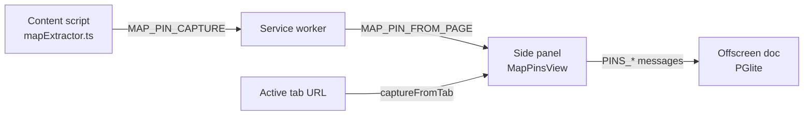

# Map pins

Map pins lets you save locations from map websites (Google Maps, OpenStreetMap, Bing Maps, Apple Maps) into organized stacks. Each pin stores coordinates, a label, notes, category, priority, star rating, and review text. Stacks can be shared via compressed share links.

## How it works

### Chrome extension

The feature has three cooperating pieces: a content script, the service worker, and the side panel UI.

**Floating Pin button on map pages**

`mapExtractor.ts` injects a small orange "Pin to My SPACE" button at `bottom: 220px right: 16px` — positioned above Google Maps' own zoom / locate / pegman controls so it never overlaps them. A small × chip beside the badge collapses it into an icon-only state. When coords are present in the URL, the badge fades in; when the user pans away (and the URL no longer matches any regex), it fades out.

The button shows three feedback states via background colour:

- Orange while idle.
- Green "Pinned!" for ~2 seconds after a successful capture.
- Red "No coords found" or "Open My SPACE first" if the capture fails.

A `MutationObserver` re-runs the URL match whenever the body subtree changes, so SPAs that swap map tiles without a real navigation (Google Maps, Bing) update the button in real time.

**Coordinate extraction**

The content script runs on `google.com/maps`, `maps.google.com`, `openstreetmap.org`, `bing.com/maps`, and `maps.apple.com`. It parses `location.href` with regex patterns for each service:

- Google Maps: `@lat,lng` in path, `?ll=lat,lng`, `?center=lat,lng`, `!3dlat!4dlng` for place data
- OpenStreetMap: `#map=zoom/lat/lng`
- Bing Maps: `cp=lat~lng`
- Apple Maps: `?ll=lat,lng`
- Generic: `?lat=N&lng=M` or `?lon=M`

If coordinates are found, it sends `MAP_PIN_CAPTURE` to the service worker, which forwards it as `MAP_PIN_FROM_PAGE` to the side panel.

**Side panel** (`MapPinsView`): a two-level navigation like To-do lists.

- **Stacks view**: list of `MapStack` cards with colored icon badges, create form (name, `IconPicker`, color picker), and shared-stack import banner.
- **Stack detail** (`StackDetail`): header with back button and Share button. Two add modes:
  - **From page**: reads the active tab's URL and title via `chrome.tabs.query`, extracts coordinates with `extractPinFromUrl` (same regex set as the content script), and pre-fills a confirm form with label, note, category, and priority.
  - **Manual**: paste a map link (auto-parses coordinates with live detection feedback) or enter lat/lng manually with validation (-90 to 90, -180 to 180). Then proceeds to the same confirm form.
- **PinRow**: displays label, coordinates (5 decimal places), priority badge, category tag, star rating, note, and review text. Expand to reveal Open Maps link, Edit, and Delete.
- **Star ratings**: 5-star interactive component with hover states, stored as `rating` (0-5).
- **Share**: `buildShareUrl` serializes the stack name, color, and pins (label, lat, lng, note, url) to JSON, compresses with `lz-string` (`compressToEncodedURIComponent`), and builds a Google Maps URL with a `#myspace-pins?d=` fragment. Opening this URL in the extension triggers the shared-stack import banner.
- **Import shared**: `decodeShareParam` decompresses the `d` parameter, creates a new stack, and bulk-inserts all pins.

`shareLink.ts` provides `encodeShareLink` and `decodeShareParam` using LZString compression, keeping share URLs compact enough for clipboard or messaging.

### Android

`MapPinsScreen` provides stack and pin management without browser integration:

- **No page capture**: Android cannot read browser URLs, so the "From page" capture flow is Chrome-only. Pin creation on Android is manual entry of coordinates and details.
- **Stack cards**: show pin counts (queried via `mapPinDao().getForStack`), with color and icon badges.
- **Pin detail view** (`MapPinsStackView`): list of pins with category, priority color coding, and coordinates.
- **No share links**: the Android version does not implement share link generation or import.
- **Color parsing**: `parseStackColor` converts hex color strings to Compose `Color` with fallback to orange.

### Pin categories and priorities

| Category | Priorities |
|----------|-----------|
| Hotel, Restaurant, Cafe, Attraction, Shopping, Transport, Hospital, Other | none, low (green), medium (yellow), high (red) |

## Key source files

| File | Description |
|------|-------------|
| `chrome-extension/src/sidepanel/views/MapPinsView.tsx` | Full map pins UI: stacks, stack detail, pin capture, manual entry, share, import |
| `chrome-extension/src/content/mapExtractor.ts` | Content script that parses map URLs and sends coordinates to service worker |
| `chrome-extension/src/lib/shareLink.ts` | LZString-compressed share link encode/decode |
| `android/app/src/main/java/com/myspace/app/ui/screens/MapPinsScreen.kt` | Android map stacks and pins view |

## Cross-links

- [To-do lists](./todo-lists.md) - shares `IconPicker`, color picker, and list/card navigation pattern
- [Chrome extension](../applications/chrome-extension.md) - content script and message routing architecture
- [Google Drive sync](./google-drive-sync.md) - map stacks and pins are included in encrypted Drive backups
