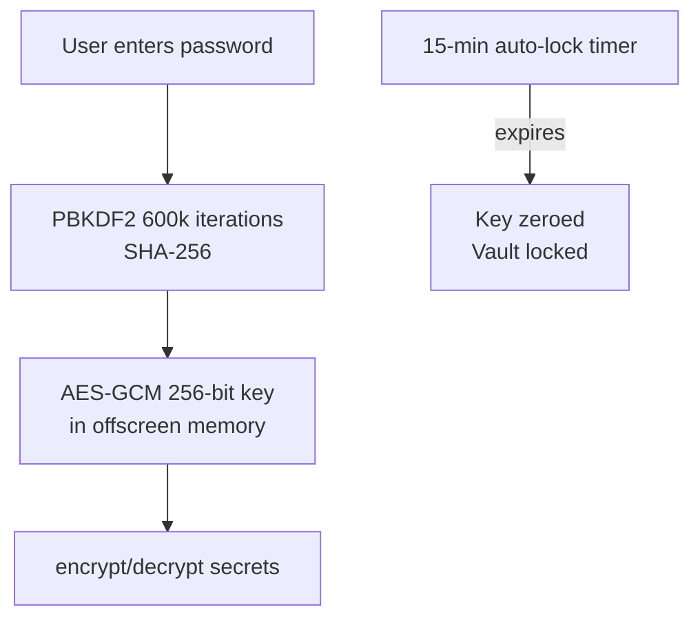

# Secret vault

The secret vault stores encrypted credentials, API keys, tokens, and other sensitive strings. Values are AES-GCM encrypted at rest and only decrypted on demand when the user reveals or copies a secret. The vault is protected by a master password and auto-locks after a configurable timeout.

## How it works

### Chrome extension

The vault uses a password-derived AES-GCM key held in memory inside the offscreen document. The key is never persisted; when the vault locks (timeout or manual lock), the key is zeroed out.

Key implementation details in `crypto.ts`:

- **Key derivation**: `deriveKey` uses `crypto.subtle` with PBKDF2 (600,000 iterations, SHA-256) and a random salt stored in `chrome.storage.local` (`vaultSalt`). The derived key is a non-extractable AES-GCM 256-bit `CryptoKey`.
- **Encryption**: `encrypt()` generates a random 12-byte IV per secret, encrypts the plaintext with AES-GCM, and returns base64-encoded ciphertext and IV.
- **Auto-lock**: `initVault` starts a `setTimeout` (default 15 minutes, configurable in Settings). `resetLockTimer` restarts the timer. `lockVault` clears the key and timer. The `KeyvaultView` polls `VAULT_STATUS` on mount and shows a live countdown ("12m 34s left") that triggers `onLock` when it reaches zero.
- **Reveal flow**: `SecretCard` calls `SECRETS_GET` to fetch the decrypted value, displays it for 30 seconds, then auto-hides. Copy uses `navigator.clipboard.writeText`.

The `KeyvaultView` UI mirrors the Notes pattern: search box, tag chips, secrets grouped by first tag, and an inline "Add secret" form at the bottom. Each `SecretCard` shows the label, a masked value (`••••••••`), and Reveal/Copy/Delete actions.

### Android

`VaultScreen` uses the Android Keystore for key management, which is a fundamentally different approach from Chrome's password-derived key:

- **Hardware-backed key**: `CryptoManager` generates a 256-bit AES-GCM key inside the Android Keystore under the alias `myspace_vault_key`. The key never leaves secure hardware. `setUserAuthenticationRequired(false)` means no biometric/PIN is needed to use the key.
- **No master password**: because the Keystore manages the key, there is no password unlock flow, no auto-lock timer, and no lock screen on Android. The vault is always "unlocked" while the app is running.
- **Encryption**: `CryptoManager.encrypt()` uses `javax.crypto.Cipher` with `AES/GCM/NoPadding`, generates a fresh IV per encryption, and returns base64 ciphertext + IV. `decrypt()` reverses this with `GCMParameterSpec(128, iv)`.
- **No tags**: the Android `SecretEntity` has a `tags` column hardcoded to `"[]"`; the UI does not surface tag filtering or grouping.
- **Reveal**: tapping the eye icon toggles between masked dots and the decrypted value inline. There is no 30-second auto-hide timeout like Chrome.
- **Add secret**: a modal bottom sheet with label and password-masked value fields, plus a visibility toggle on the value input.

### Data model

Secrets store `id`, `label`, `ciphertext`, `iv`, `tags` (JSON array), `url`, `description`, `created_at`, `updated_at`. Only the label, tags, URL and description are stored in plaintext; the value is always encrypted. The URL and description columns power the save-password matcher (the content script compares the page hostname to the secret's URL field) and give a free-form hint next to each card. The DAO on Android exposes `getMeta()` which returns all metadata columns without ciphertext for list rendering.

## Inline edit

Each `SecretCard` has an Edit action that opens an inline form right inside the card. The user can change label, value (leave empty to keep current), URL and description, and save via `SECRETS_UPDATE`. Cancel reverts the form. Tag editing is done via delete + recreate, to keep the inline form compact.

## Save Password prompt (web) — opt-in

A second content script — `savePrompt.ts` — wants to run on every login form. Because that would normally trigger Chrome Web Store's "Broad Host Permissions" review, the extension ships with **no content-script registration for `<all_urls>`** and **no broad host grant**. The Settings view shows an opt-in card with an orange "Enable on every site" button. Clicking it calls `SAVE_PROMPT_ENABLE`, which asks `chrome.permissions.request({ origins: ['<all_urls>'] })`. On grant the service worker calls `chrome.scripting.registerContentScripts` with id `save-prompt-v1`, attaching the bundled `savePrompt.js` (built with a non-hashed filename so the registration code can reference it stably).

Once registered, the script detects login forms (`<input type="password">` plus a username/email field), and once the user has typed a real password (≥ 4 chars) it shows a floating orange "Save to My SPACE?" badge beside the field. Clicking the badge sends the credentials to the service worker, which forwards them to the side panel. `KeyvaultView` listens for `SAVE_PASSWORD_OFFER_FROM_PAGE` and renders a confirm card at the top with label (default = hostname), URL, tags (auto-tagged `auto-saved`) and description pre-filled. The user reviews and clicks "Save to Vault", and `SECRETS_CREATE` encrypts and stores the entry.

If the side panel is not open, the badge shows "Open My SPACE first" and the user clicks the extension icon. The badge can also be dismissed with a small × chip. The Settings card has a "disable" action that calls `SAVE_PROMPT_DISABLE`, which unregisters the script and removes the `<all_urls>` grant via `chrome.permissions.remove`. On `chrome.runtime.onStartup` and `chrome.runtime.onInstalled` the service worker re-checks `chrome.permissions.contains` and re-registers the script if the user previously granted, so the feature survives upgrades.

## Key source files

| File | Description |
|------|-------------|
| `chrome-extension/src/sidepanel/views/KeyvaultView.tsx` | Vault UI: countdown, search, tag filter, secret cards, add form |
| `chrome-extension/src/offscreen/crypto.ts` | PBKDF2 key derivation, AES-GCM encrypt/decrypt, lock timer logic |
| `chrome-extension/src/sidepanel/components/SecretCard.tsx` | Secret display card with reveal/copy/delete and 30s auto-hide |
| `android/app/src/main/java/com/myspace/app/ui/screens/VaultScreen.kt` | Android vault list + add-secret bottom sheet |
| `android/app/src/main/java/com/myspace/app/crypto/CryptoManager.kt` | Android Keystore-backed AES-GCM encryption |

## Cross-links

- [Chrome extension](../applications/chrome-extension.md) - offscreen document hosts the crypto key and PGlite database
- [Password generator](./password-generator.md) - generated passwords can be manually copied into the vault
- [Import](./import.md) - bulk import secrets from Bitwarden/1Password exports
- [Google Drive sync](./google-drive-sync.md) - secrets are included in encrypted Drive backups; cross-device pull requires master password re-derivation
