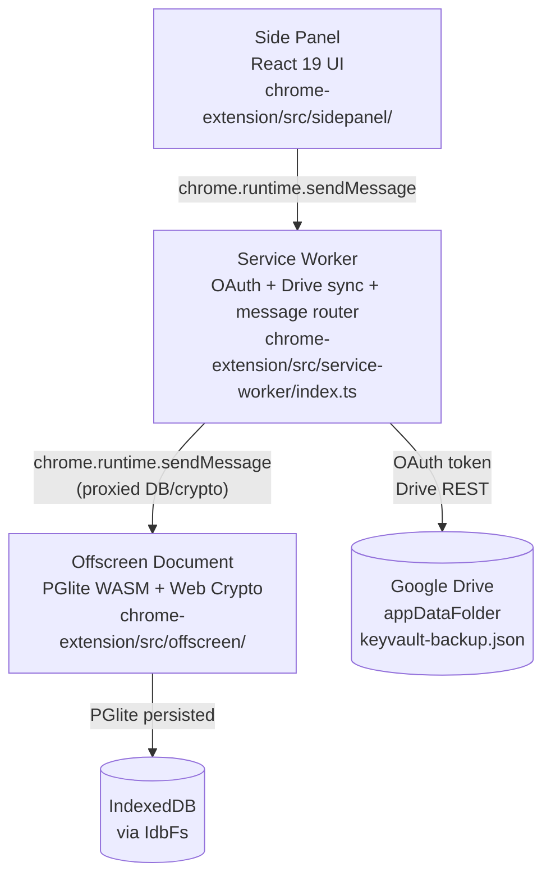
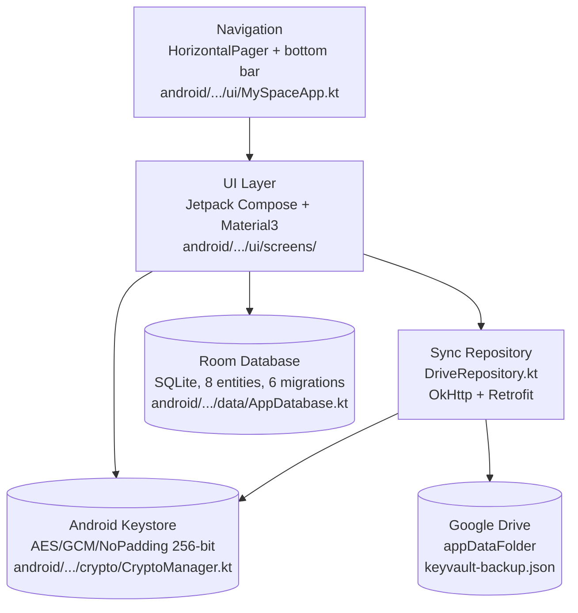
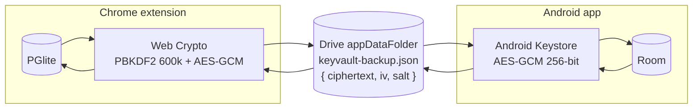

# Architecture

My SPACE has two independently shipped platforms that share a single encrypted backup format. This page describes both, starting with the Chrome extension's three-context MV3 architecture and then the Android app's layered Compose architecture.

## Chrome extension: three execution contexts

Chrome MV3 forces a strict separation of concerns. The side panel is the UI, the service worker is the long-lived router and network layer, and the offscreen document is the only context allowed to run WebAssembly (PGlite) and host crypto. They talk exclusively through `chrome.runtime.sendMessage`.



### Why three contexts

- **Service workers cannot run WebAssembly.** PGlite is Postgres compiled to WASM, so it has to live somewhere else. Chrome's `offscreen` API is the sanctioned place.
- **The offscreen document cannot call `chrome.identity.getAuthToken`** or make Drive REST calls the way the service worker can. OAuth and network live in the service worker.
- **The side panel is ephemeral UI.** It closes when the user collapses it, so it must not own state. It sends a message and renders the reply.

### Message flow

The service worker is a router. For DB or crypto operations it forwards the message to the offscreen document. For OAuth, sync, and everything else it handles the message itself.

```mermaid
sequenceDiagram
    participant SP as Side Panel (React)
    participant SW as Service Worker
    participant OFF as Offscreen Document
    participant G as Google Drive

    Note over SP: User edits a note
    SP->>SW: NOTES_UPDATE { id, content, ... }
    SW->>OFF: NOTES_UPDATE (proxied)
    OFF->>OFF: PGlite UPDATE notes
    OFF-->>SW: { ok: true }
    SW-->>SP: { ok: true }

    Note over SP: User taps Sync Push
    SP->>SW: SYNC_PUSH
    SW->>OFF: DB_EXPORT
    OFF-->>SW: { rows: {...} }
    SW->>OFF: SYNC_ENCRYPT { plaintext }
    OFF-->>SW: { ciphertext, iv }
    SW->>G: PUT appDataFolder/keyvault-backup.json
    G-->>SW: 200 OK
    SW-->>SP: { ok: true }
```

### Side panel internals

The React app in `chrome-extension/src/sidepanel/App.tsx` renders an icon rail plus one of eight views. Views receive a single `sendMsg` prop and are otherwise stateless about how the message is delivered. The `GATED_VIEWS` set marks views that require `VAULT_UNLOCK` first.

```
App.tsx
  ├── IconRail.tsx          vertical navigation
  ├── views/
  │     NotesView, KeyvaultView, GeneratorView, SubscriptionsView,
  │     ReportsView, TodoView, MapPinsView, SyncView, SettingsView
  └── components/
        NoteCard, SecretCard, TagInput, IconPicker, icons/
```

### Offscreen internals

`chrome-extension/src/offscreen/main.ts` wires `chrome.runtime.onMessage` to `handler.ts`, which dispatches by `type` into `db.ts` (CRUD for 8 tables) or `crypto.ts` (PBKDF2, AES-GCM). PGlite is persisted to IndexedDB via `IdbFs`. The vault key lives only in this context's memory and is cleared on `VAULT_LOCK`.

### Service worker internals

`chrome-extension/src/service-worker/index.ts` does three jobs:

1. Route DB/crypto messages to the offscreen document (creating it on demand).
2. Run OAuth via `chrome.identity.getAuthToken` with scopes `drive.appdata`, `userinfo.email`, `userinfo.profile`.
3. Push/pull `keyvault-backup.json` to Drive `appDataFolder`, refreshing tokens on 401.

### Data storage

| Store | Where | Notes |
|---|---|---|
| All app tables | PGlite in IndexedDB via `IdbFs` | 8 tables: notes, secrets, subscriptions, bills, todo_lists, todo_tasks, map_stacks, map_pins |
| Vault salt | `chrome.storage.local` `vaultSalt` | 16-byte random salt, included in backups |
| Encrypted backup | Drive `appDataFolder` `keyvault-backup.json` | `{ ciphertext, iv }` plus salt metadata |

## Android app: layered Compose architecture

The Android app mirrors the extension's feature set with a layered structure: UI composables on top, Room database and crypto below, and a Drive sync repository on the side.



### Layer responsibilities

- **UI** (`ui/screens/`): 9 composables (Splash, Notes, Vault, Generator, Subscriptions, Todo, MapPins, Sync, Reports). Each screen reads from Room via DAOs and writes back directly; there is no separate ViewModel layer.
- **Theme** (`ui/theme/Theme.kt`, `ui/theme/Typography.kt`): a dark Material3 colour scheme with per-feature accent colours matching the extension's design tokens.
- **Data** (`data/AppDatabase.kt`): one Room database with all entities, DAOs, and migrations v1 through v7.
- **Crypto** (`crypto/CryptoManager.kt`): Android Keystore AES-GCM under alias `myspace_vault_key`. Hardware-backed on devices with a Trusted Execution Environment. IV is random per encryption and stored alongside ciphertext in Room.
- **Sync** (`sync/DriveRepository.kt`): OAuth implicit flow plus Drive REST v3 push/pull. Uses the same `keyvault-backup.json` file and JSON payload shape as the extension.

### Cross-platform compatibility

Both platforms write the same plaintext JSON shape inside the encrypted backup:

```json
{ "notes": [...], "secrets": [...], "subscriptions": [...] }
```

The encryption keys themselves are platform-local (Web Crypto on Chrome, Android Keystore on Android) and non-exportable. On pull, the receiving platform decrypts the backup and re-encrypts with its own local key. Data is never stored unencrypted on disk on either side.

> Note: The Android `DriveExport` currently syncs notes, secrets, and subscriptions. Todo, Map Pins, and Bills sync from the extension are not yet consumed by Android.

## Shared sync contract



The backup is self-contained: it carries the vault's PBKDF2 salt next to the ciphertext. On a device with a different local salt, the pull flow detects the mismatch and prompts for the master password, then re-derives a temporary key from the backup's salt to decrypt (never caching it), imports the rows, and updates the local salt.
