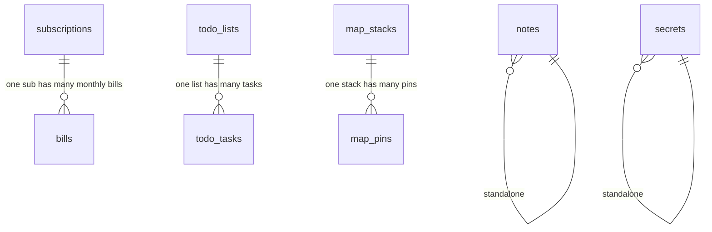

# Data models

My SPACE has 8 entity types. Both platforms model the same domain, but the Chrome extension's PGlite schema uses PostgreSQL conventions (`snake_case`, `TIMESTAMPTZ`, `TEXT[]`) while the Android app's Room schema uses Kotlin conventions (`camelCase`, `Long` epoch millis, `String` for tags). This page documents every field of every entity and the naming differences side by side.

Source files: `chrome-extension/src/shared/messages.ts` and `chrome-extension/src/offscreen/db.ts` for the Chrome shapes, `android/app/src/main/java/com/myspace/app/data/AppDatabase.kt` for the Android shapes.

## Notes

Stores markdown notes with optional inline images. Images are a JSON array of base64 data URLs on Chrome, a serialised string on Android.

| Chrome field | Type | Android field | Type | Purpose |
|--------------|------|---------------|------|---------|
| `id` | `TEXT` (UUID) | `id` | `String` | Primary key |
| `title` | `TEXT` | `title` | `String` | Note title |
| `content` | `TEXT` | `content` | `String` | Markdown body |
| `tags` | `TEXT[]` | `tags` | `String` | Tags (Postgres array vs serialised) |
| `image_data` | `TEXT` (JSON array of data URLs) | `imageUris` | `String` | Inline images |
| `created_at` | `TIMESTAMPTZ` | `createdAt` | `Long` | Creation timestamp |
| `updated_at` | `TIMESTAMPTZ` | `updatedAt` | `Long` | Last edit timestamp |

## Secrets

Stores encrypted credentials. The plaintext `value` is never persisted; only `ciphertext` and `iv` are stored. See [cryptography](../systems/crypto.md).

| Chrome field | Type | Android field | Type | Purpose |
|--------------|------|---------------|------|---------|
| `id` | `TEXT` (UUID) | `id` | `String` | Primary key |
| `label` | `TEXT` | `label` | `String` | Human-readable name |
| `ciphertext` | `TEXT` (base64) | `ciphertext` | `String` (base64) | AES-GCM ciphertext |
| `iv` | `TEXT` (base64) | `iv` | `String` (base64) | 12-byte initialisation vector |
| `tags` | `TEXT[]` | `tags` | `String` | Tags |
| `created_at` | `TIMESTAMPTZ` | `createdAt` | `Long` | Creation timestamp |
| `updated_at` | `TIMESTAMPTZ` | `updatedAt` | `Long` | Last edit timestamp |

The `SecretMeta` projection (used by `SECRETS_LIST` and `SecretDao.getMeta()`) omits `ciphertext` and `iv` so list views never touch sensitive material.

## Subscriptions

Tracks recurring subscriptions. `amount` is `NUMERIC(10,2)` on Chrome (returned as string by PGlite) and `Double` on Android.

| Chrome field | Type | Android field | Type | Purpose |
|--------------|------|---------------|------|---------|
| `id` | `TEXT` (UUID) | `id` | `String` | Primary key |
| `name` | `TEXT` | `name` | `String` | Subscription name |
| `amount` | `NUMERIC(10,2)` | `amount` | `Double` | Cost |
| `currency` | `TEXT` (default `USD`) | `currency` | `String` | ISO currency code |
| `cycle` | `TEXT` (default `monthly`) | `cycle` | `String` | `monthly` / `yearly` / `weekly` / `one-time` |
| `start_date` | `TEXT` | `startDate` | `String` | ISO date `yyyy-MM-dd` |
| `tags` | `TEXT[]` | `tags` | `String` | Tags |
| `notes` | `TEXT` | `notes` | `String` | Free-form notes |
| (not present) | — | `logoUri` | `String` (default `""`) | Subscription logo URI (Android only) |
| `active` | `BOOLEAN` (default `true`) | `active` | `Boolean` (default `true`) | Whether the subscription is active |
| `created_at` | `TIMESTAMPTZ` | `createdAt` | `Long` | Creation timestamp |
| `updated_at` | `TIMESTAMPTZ` | `updatedAt` | `Long` | Last edit timestamp |

## Bills

Monthly bill records tied to a subscription. Uses a composite primary key, no separate `id`.

| Chrome field | Type | Android field | Type | Purpose |
|--------------|------|---------------|------|---------|
| `sub_id` | `TEXT` | `subId` | `String` | FK to subscription (part of PK) |
| `year` | `INTEGER` | `year` | `Int` | Year (part of PK) |
| `month` | `INTEGER` (1-12) | `month` | `Int` (1-12) | Month (part of PK) |
| `amount` | `NUMERIC(10,2)` | `amount` | `Double` | Billed amount |
| `currency` | `TEXT` (default `USD`) | `currency` | `String` | ISO currency code |
| `notes` | `TEXT` (default `''`) | `notes` | `String` (default `""`) | Free-form notes |
| `updated_at` | `TIMESTAMPTZ` | `updatedAt` | `Long` | Last edit timestamp |

Primary key: `(sub_id, year, month)` on Chrome, `(subId, year, month)` on Android.

## Todo lists

A named, coloured list that groups todo tasks. No `updated_at`, so sync uses first-write-wins (see [database](../systems/database.md)).

| Chrome field | Type | Android field | Type | Purpose |
|--------------|------|---------------|------|---------|
| `id` | `TEXT` (UUID) | `id` | `String` | Primary key |
| `name` | `TEXT` | `name` | `String` | List name |
| `color` | `TEXT` (default `#818cf8`) | `color` | `String` | Hex colour |
| `icon` | `TEXT` (default `''`) | `icon` | `String` (default `""`) | Optional icon identifier |
| `created_at` | `TIMESTAMPTZ` | `createdAt` | `Long` | Creation timestamp |

## Todo tasks

A task within a todo list. References `todo_lists` via foreign key with `ON DELETE CASCADE` on Chrome.

| Chrome field | Type | Android field | Type | Purpose |
|--------------|------|---------------|------|---------|
| `id` | `TEXT` (UUID) | `id` | `String` | Primary key |
| `list_id` | `TEXT` (FK) | `listId` | `String` | FK to todo list |
| `title` | `TEXT` | `title` | `String` | Task title |
| `note` | `TEXT` (default `''`) | `note` | `String` (default `""`) | Free-form note |
| `priority` | `TEXT` (default `medium`) | `priority` | `String` (default `medium`) | `low` / `medium` / `high` |
| `due_date` | `TEXT` (nullable) | `dueDate` | `String?` (nullable) | ISO date or null |
| `recurrence` | `TEXT` (default `none`) | `recurrence` | `String` (default `none`) | `none` / `daily` / `weekly` / `monthly` |
| `done` | `BOOLEAN` (default `false`) | `done` | `Boolean` (default `false`) | Completion flag |
| `created_at` | `TIMESTAMPTZ` | `createdAt` | `Long` | Creation timestamp |
| `updated_at` | `TIMESTAMPTZ` | `updatedAt` | `Long` | Last edit timestamp |

## Map stacks

A named, coloured group of map pins. Like todo lists, no `updated_at` and sync uses first-write-wins.

| Chrome field | Type | Android field | Type | Purpose |
|--------------|------|---------------|------|---------|
| `id` | `TEXT` (UUID) | `id` | `String` | Primary key |
| `name` | `TEXT` | `name` | `String` | Stack name |
| `color` | `TEXT` (default `#34d399`) | `color` | `String` | Hex colour |
| `icon` | `TEXT` (default `''`) | `icon` | `String` (default `""`) | Optional icon identifier |
| `created_at` | `TIMESTAMPTZ` | `createdAt` | `Long` | Creation timestamp |

## Map pins

A geotagged pin within a map stack. References `map_stacks` via foreign key with `ON DELETE CASCADE` on Chrome. No `updated_at`, sync uses first-write-wins.

| Chrome field | Type | Android field | Type | Purpose |
|--------------|------|---------------|------|---------|
| `id` | `TEXT` (UUID) | `id` | `String` | Primary key |
| `stack_id` | `TEXT` (FK) | `stackId` | `String` | FK to map stack |
| `label` | `TEXT` | `label` | `String` | Pin label |
| `lat` | `DOUBLE PRECISION` | `lat` | `Double` | Latitude |
| `lng` | `DOUBLE PRECISION` | `lng` | `Double` | Longitude |
| `url` | `TEXT` (default `''`) | `url` | `String` (default `""`) | Associated URL |
| `note` | `TEXT` (default `''`) | `note` | `String` (default `""`) | Free-form note |
| `priority` | `TEXT` (default `none`) | `priority` | `String` (default `none`) | `none` / `low` / `medium` / `high` |
| `category` | `TEXT` (default `''`) | `category` | `String` (default `""`) | Category label |
| `rating` | `INTEGER` (default `0`) | `rating` | `Int` (default `0`) | Numeric rating |
| `review_note` | `TEXT` (default `''`) | `reviewNote` | `String` (default `""`) | Review text |
| `created_at` | `TIMESTAMPTZ` | `createdAt` | `Long` | Creation timestamp |

## Naming convention comparison

### Column casing

| Convention | Chrome (PGlite) | Android (Room) |
|------------|-----------------|----------------|
| Multi-word columns | `snake_case` (`start_date`, `created_at`, `sub_id`) | `camelCase` (`startDate`, `createdAt`, `subId`) |
| Single-word columns | identical | identical |

### Type mapping

| Concept | Chrome (PGlite) | Android (Room) |
|---------|-----------------|----------------|
| Primary key UUID | `TEXT DEFAULT gen_random_uuid()` | `String` (app-generated) |
| Timestamps | `TIMESTAMPTZ` (ISO 8601 string) | `Long` (epoch milliseconds) |
| Tags | `TEXT[]` (native Postgres array) | `String` (serialised) |
| Money/amount | `NUMERIC(10,2)` (returned as string) | `Double` |
| Boolean | `BOOLEAN` | `Boolean` (stored as `INTEGER`) |
| Coordinates | `DOUBLE PRECISION` | `Double` |
| Nullable text | `TEXT` (nullable by default) | `String?` (explicit nullable) |

### Platform-specific fields

| Field | Platform | Why |
|-------|----------|-----|
| `image_data` / `imageUris` | Both | Named differently; Chrome stores JSON array of data URLs, Android stores a string |
| `logoUri` | Android only | Subscription logo URI; Chrome does not have this column |
| `active` | Both | Added via migration on both platforms |

## Entity relationship summary

Three parent-child relationships, two standalone entities. No many-to-many relationships exist.

## Related pages

- [Database](../systems/database.md) — schema definitions, migrations, and conflict resolution.
- [Message protocol](../systems/message-protocol.md) — the message types that carry these shapes across the extension contexts.
- [Cryptography](../systems/crypto.md) — how the `secrets` entity's `ciphertext` and `iv` are produced.
- [Chrome extension](../applications/chrome-extension.md) and [Android app](../applications/android-app.md) — the UIs that render these entities.
