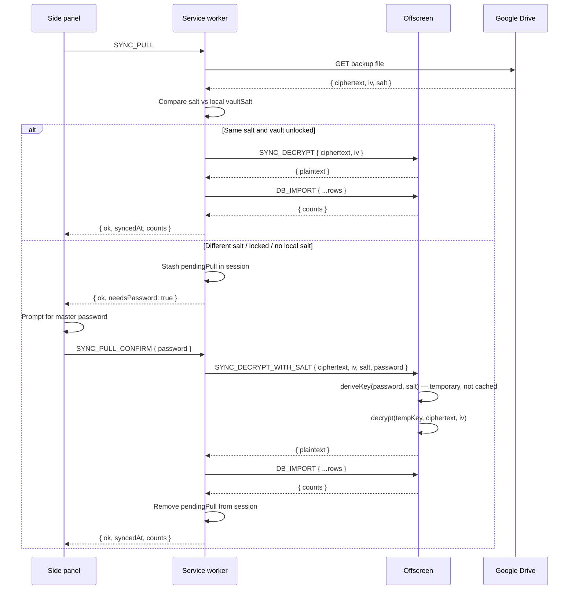
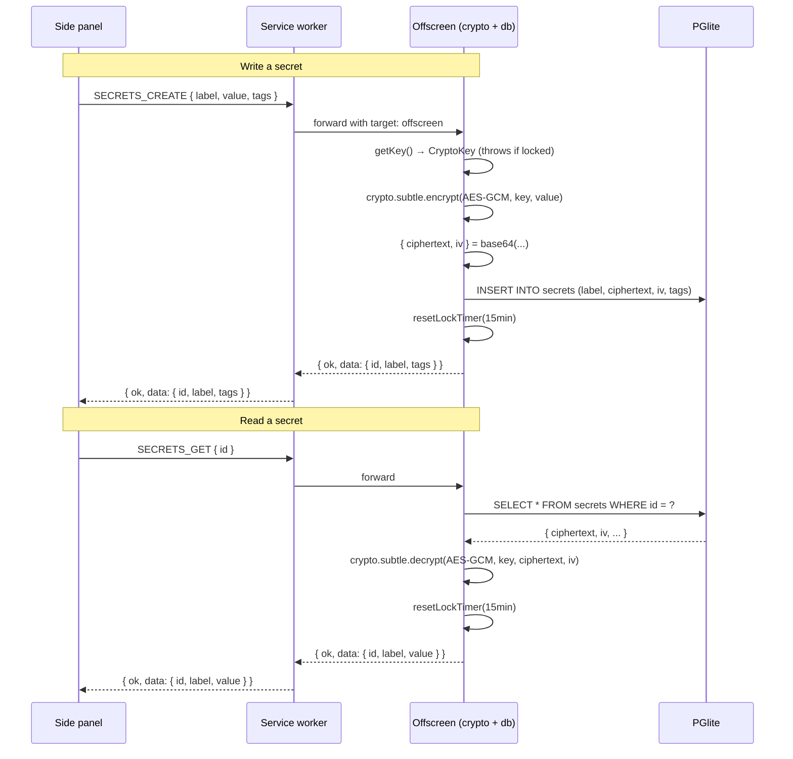

# Cryptography

My SPACE encrypts secrets at rest and encrypts sync payloads in transit to Google Drive. The two platforms use different crypto primitives because of their different runtime constraints, but both converge on AES-GCM for authenticated encryption. This page covers the Chrome extension's Web Crypto implementation, the Android app's Keystore implementation, and how the two interoperate during cross-device sync.

## Chrome extension: Web Crypto PBKDF2 + AES-GCM

All crypto lives in `chrome-extension/src/offscreen/crypto.ts`, running inside the offscreen document. The service worker cannot hold a `CryptoKey` (it gets torn down), and the side panel cannot use the Web Crypto subtle API reliably for long-lived state, so the offscreen document is the only place the key ever materialises.

### Key derivation

```ts
export async function deriveKey(password: string, salt: Uint8Array): Promise<CryptoKey> {
  const enc = new TextEncoder()
  const baseKey = await crypto.subtle.importKey('raw', enc.encode(password), 'PBKDF2', false, ['deriveKey'])
  return crypto.subtle.deriveKey(
    { name: 'PBKDF2', salt: salt.buffer, iterations: 600_000, hash: 'SHA-256' },
    baseKey,
    { name: 'AES-GCM', length: 256 },
    false,                  // not extractable
    ['encrypt', 'decrypt'],
  )
}
```

The master password is stretched into a 256-bit AES-GCM key using PBKDF2 with SHA-256 and **600,000 iterations**. The derived `CryptoKey` is marked `extractable: false`, meaning JavaScript can never read the raw key bytes; it can only pass the handle back into `crypto.subtle.encrypt` / `decrypt`.

The salt is a 16-byte random value generated once during first-time setup (see [Chrome extension](../applications/chrome-extension.md)) and stored in `chrome.storage.local` under `vaultSalt`. The salt is not secret; it exists to ensure that two users with the same password derive different keys.

### Encrypt and decrypt

```ts
export async function encrypt(key, plaintext): Promise<{ ciphertext: string; iv: string }>
export async function decrypt(key, ciphertext, iv): Promise<string>
```

Encryption generates a fresh 12-byte random IV per call via `crypto.getRandomValues`, encrypts the UTF-8 encoded plaintext with AES-GCM (which produces ciphertext with an appended 128-bit authentication tag), and returns both as base64 strings. Decryption reverses this; if the tag verification fails (wrong key, corrupted ciphertext), `crypto.subtle.decrypt` throws and the caller surfaces an error.

### Vault lifecycle

Three module-level variables hold the vault state:

- `_key: CryptoKey | null` — the derived key, or `null` when locked.
- `_lockTimer` — a `setTimeout` handle for the auto-lock timer.
- `_expiresAt` — the absolute timestamp when the key will expire, exposed via `getVaultStatus()`.

`initVault(password, salt, timeoutMs)` derives the key and starts the auto-lock timer. `lockVault()` sets `_key = null`, clears the timer, and clears `_expiresAt`. `getKey()` throws if the vault is locked; every secret operation calls it.

### Auto-lock timer

`resetLockTimer(timeoutMs)` resets the `setTimeout` that will call `lockVault()` after the configured period. The default is 15 minutes (`15 * 60 * 1000`), set in `handler.ts` as `LOCK_TIMEOUT_MS`. The timer is reset on every secret read/write (`SECRETS_GET`, `SECRETS_CREATE`, `SECRETS_UPDATE`) so active use keeps the vault open.

The side panel has its own complementary idle timer (see [Chrome extension](../applications/chrome-extension.md)) that watches `mousemove`/`keydown` and sends `VAULT_LOCK` if the user goes idle. The offscreen timer is a backstop for when the side panel is closed but the offscreen document persists.

## Android app: Android Keystore AES-GCM

`android/app/src/main/java/com/myspace/app/crypto/CryptoManager.kt` takes a fundamentally different approach. Instead of deriving a key from a user password, it lets the Android Keystore generate and store a 256-bit AES-GCM key in secure hardware (TEE / StrongBox where available). The key never leaves the keystore.

```kotlin
object CryptoManager {
    private const val KEYSTORE  = "AndroidKeyStore"
    private const val ALIAS     = "myspace_vault_key"
    private const val TRANSFORM = "AES/GCM/NoPadding"
    private const val TAG_LEN   = 128
    ...
}
```

### Key creation

`getOrCreateKey()` loads the keystore, checks for an existing key under alias `myspace_vault_key`, and if absent generates one with `KeyGenParameterSpec`:

- `PURPOSE_ENCRYPT | PURPOSE_DECRYPT`
- Block mode GCM, padding none
- `setUserAuthenticationRequired(false)` (biometric unlock is not yet wired up despite the manifest permissions)
- 256-bit key size

Because the key is hardware-backed, even a rooted device cannot extract it.

### Encrypt and decrypt

`encrypt(plaintext)` initialises a `Cipher` in encrypt mode (the keystore supplies a fresh IV), encrypts the UTF-8 bytes, and returns `(ciphertext, iv)` as base64 strings. `decrypt(ciphertext, iv)` initialises the cipher in decrypt mode with a `GCMParameterSpec(128, ivBytes)` and returns the plaintext. The 128-bit GCM tag is handled internally by the provider.

There is no password, no PBKDF2, and no auto-lock timer on Android. The keystore key persists across app restarts. The security boundary is the device lock screen plus the keystore's hardware isolation, not a user-chosen password.

## Cross-device decrypt with SYNC_DECRYPT_WITH_SALT

The tricky part of cross-platform sync is that the Chrome extension encrypts sync payloads with a PBKDF2-derived key (tied to the user's password + local salt), while the Android app encrypts with a keystore key that has no password equivalent. The current sync design favours the Chrome extension's password-based scheme as the canonical sync encryption.

When the Chrome extension pushes to Drive, it includes the salt in the backup file alongside the ciphertext and IV:

```json
{ "ciphertext": "...", "iv": "...", "salt": [123, 45, ...] }
```

This makes the backup self-contained: any device with the same master password can decrypt it, regardless of its own local salt. The pull flow (`chrome-extension/src/service-worker/index.ts`) handles three cases:

1. **Same salt** (same device/profile) — decrypt normally with the current vault key via `SYNC_DECRYPT`.
2. **Different salt or no local salt** (cross-device) — stash the encrypted payload in `chrome.storage.session` as `pendingPull` and return `{ needsPassword: true }`. The side panel prompts for the master password, then sends `SYNC_PULL_CONFIRM` with the password.
3. **Decrypt fails despite matching salt** (vault key was derived from a different salt than the backup's) — fall back to the password prompt path.

`SYNC_PULL_CONFIRM` calls `SYNC_DECRYPT_WITH_SALT`, which re-derives a **temporary** key from the provided password and the backup's salt, decrypts, and discards the key immediately. The key is never cached in `_key`, so the cross-device decrypt does not unlock the local vault.



## Encrypt/decrypt flow (Mermaid)

The following sequence shows the common path for a secret write on the Chrome extension, from side panel through to PGlite, and the reverse for a read:



## Salt storage

| Platform | Salt location | Salt generation |
|----------|---------------|-----------------|
| Chrome   | `chrome.storage.local['vaultSalt']` (array of 16 numbers) | `crypto.getRandomValues(new Uint8Array(16))` during setup |
| Android  | N/A (keystore key, no salt) | Keystore generates the key internally |

The salt is included in every Drive backup so that a new device can re-derive the Chrome vault key without having previously seen the salt. The Android app's keystore key is device-local and does not participate in cross-device sync decryption.

## Key material summary

| Property | Chrome | Android |
|----------|--------|---------|
| Algorithm | AES-256-GCM | AES-256-GCM |
| Key derivation | PBKDF2-SHA256, 600k iterations | Keystore-generated, hardware-backed |
| Key storage | In-memory `CryptoKey` (offscreen document) | Android Keystore (TEE/StrongBox) |
| Extractable | No | No (hardware-bound) |
| Auth tag | 128-bit (Web Crypto default) | 128-bit (`TAG_LEN`) |
| IV | 12 bytes random per encrypt | 12 bytes keystore-generated per encrypt |
| Auto-lock | 15 min timer, reset on activity | None (keystore key persists) |
| Cross-device decrypt | Yes, via `SYNC_DECRYPT_WITH_SALT` + password | Via Chrome extension's password scheme |

## Related pages

- [Message protocol](./message-protocol.md) — the `VAULT_*`, `SECRETS_*`, and `SYNC_*` message types that drive these functions.
- [Database](./database.md) — where encrypted secret rows are stored.
- [Security](../security.md) — why 600k PBKDF2 iterations, why no servers.
- [Chrome extension](../applications/chrome-extension.md) — the setup screen that creates the salt.
