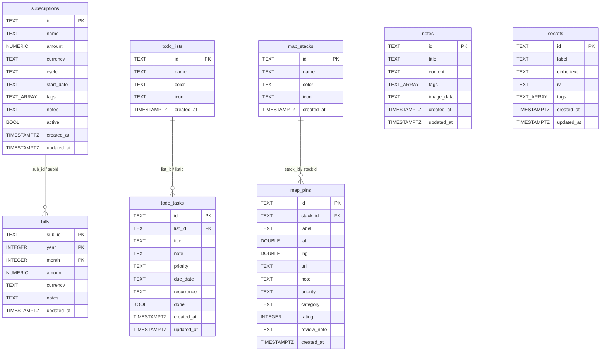

# Database

My SPACE stores all user data locally. The Chrome extension uses PGlite (Postgres in WASM, persisted to IndexedDB) and the Android app uses Room (SQLite via AndroidX). Both platforms model the same 8 entity types, but with different column naming conventions and different migration strategies. This page covers both schemas, the export/import logic, and the conflict-resolution rules that make sync safe.

## PGlite schema (Chrome extension)

The database module lives in `chrome-extension/src/offscreen/db.ts`. PGlite is initialised with an `IdbFs('my-space-db')` backend so the Postgres data files live in IndexedDB and survive across extension reloads:

```ts
db = new PGlite({ fs: new IdbFs('my-space-db') })
await db.exec(`CREATE TABLE IF NOT EXISTS ...`)
```

### 8 tables

All 8 tables are created in a single `db.exec` call on startup. PostgreSQL conventions apply: `snake_case` columns, `TEXT[]` arrays for tags, `TIMESTAMPTZ` defaults, `gen_random_uuid()` for IDs.

1. **`notes`** — `id` (PK, UUID), `title`, `content`, `tags TEXT[]`, `image_data TEXT` (JSON array of base64 data URLs), `created_at`, `updated_at`.
2. **`secrets`** — `id` (PK), `label`, `ciphertext TEXT`, `iv TEXT`, `tags TEXT[]`, `created_at`, `updated_at`. The plaintext is never stored; see [cryptography](./crypto.md).
3. **`subscriptions`** — `id` (PK), `name`, `amount NUMERIC(10,2)`, `currency`, `cycle`, `start_date TEXT`, `tags TEXT[]`, `notes`, `active BOOLEAN`, `created_at`, `updated_at`.
4. **`bills`** — composite PK `(sub_id, year, month)`, `amount NUMERIC(10,2)`, `currency`, `notes`, `updated_at`. No separate `id` column.
5. **`todo_lists`** — `id` (PK), `name`, `color`, `icon`, `created_at`. No `updated_at`.
6. **`todo_tasks`** — `id` (PK), `list_id` (FK → `todo_lists(id)` ON DELETE CASCADE), `title`, `note`, `priority`, `due_date TEXT` (nullable), `recurrence`, `done BOOLEAN`, `created_at`, `updated_at`.
7. **`map_stacks`** — `id` (PK), `name`, `color`, `icon`, `created_at`. No `updated_at`.
8. **`map_pins`** — `id` (PK), `stack_id` (FK → `map_stacks(id)` ON DELETE CASCADE), `label`, `lat DOUBLE PRECISION`, `lng DOUBLE PRECISION`, `url`, `note`, `priority`, `category`, `rating INTEGER`, `review_note`, `created_at`.

### ALTER TABLE migrations

PGlite migrations are additive `ALTER TABLE ... ADD COLUMN IF NOT EXISTS` statements appended to the same `db.exec` call. There is no version tracking; the `IF NOT EXISTS` guard makes them idempotent so they run safely on both fresh databases and older ones:

```sql
ALTER TABLE notes          ADD COLUMN IF NOT EXISTS tags       TEXT[] NOT NULL DEFAULT '{}';
ALTER TABLE secrets        ADD COLUMN IF NOT EXISTS tags       TEXT[] NOT NULL DEFAULT '{}';
ALTER TABLE notes          ADD COLUMN IF NOT EXISTS image_data TEXT   NOT NULL DEFAULT '[]';
ALTER TABLE subscriptions  ADD COLUMN IF NOT EXISTS active     BOOLEAN NOT NULL DEFAULT true;
ALTER TABLE todo_lists     ADD COLUMN IF NOT EXISTS icon       TEXT   NOT NULL DEFAULT '';
ALTER TABLE map_stacks     ADD COLUMN IF NOT EXISTS icon       TEXT   NOT NULL DEFAULT '';
ALTER TABLE map_pins       ADD COLUMN IF NOT EXISTS priority   TEXT   NOT NULL DEFAULT 'none';
ALTER TABLE map_pins       ADD COLUMN IF NOT EXISTS category   TEXT   NOT NULL DEFAULT '';
ALTER TABLE map_pins       ADD COLUMN IF NOT EXISTS rating     INTEGER NOT NULL DEFAULT 0;
ALTER TABLE map_pins       ADD COLUMN IF NOT EXISTS review_note TEXT  NOT NULL DEFAULT '';
```

This works because PGlite is single-client (one offscreen document); there is no concurrent-migration risk.

### Query patterns

List queries support optional `query` (ILIKE on title/name/label) and `tag` (`$1 = ANY(tags)`) filters, built dynamically with parameterised placeholders. Updates build a dynamic `SET` clause from only the provided fields and always bump `updated_at = now()`. Tags are stored as native Postgres arrays and queried with `unnest(tags)` for the tag-list endpoints.

## Room schema (Android app)

`android/app/src/main/java/com/myspace/app/data/AppDatabase.kt` defines 8 `@Entity` data classes and 8 `@Dao` interfaces. The database is at version 7 with 6 numbered migrations. Android/Room conventions apply: `camelCase` columns, epoch-millis `Long` timestamps, `String` for tags (serialised), `Double` for `amount` (Room does not have `NUMERIC`).

### 8 entities

The entities mirror the PGlite tables one for one but with Android naming:

- `NoteEntity` — `id`, `title`, `content`, `tags String`, `imageUris String`, `createdAt Long`, `updatedAt Long`.
- `SecretEntity` — `id`, `label`, `ciphertext`, `iv`, `tags String`, `createdAt Long`, `updatedAt Long`.
- `SubscriptionEntity` — `id`, `name`, `amount Double`, `currency`, `cycle`, `startDate String`, `tags`, `notes`, `logoUri String`, `active Boolean`, `createdAt`, `updatedAt`.
- `BillEntity` — composite PK `(subId, year, month)`, `amount Double`, `currency`, `notes`, `updatedAt`. No `id`.
- `TodoListEntity` — `id`, `name`, `color`, `icon`, `createdAt`. No `updatedAt`.
- `TodoTaskEntity` — `id`, `listId`, `title`, `note`, `priority`, `dueDate String?`, `recurrence`, `done Boolean`, `createdAt`, `updatedAt`.
- `MapStackEntity` — `id`, `name`, `color`, `icon`, `createdAt`. No `updatedAt`.
- `MapPinEntity` — `id`, `stackId`, `label`, `lat Double`, `lng Double`, `url`, `note`, `priority`, `category`, `rating Int`, `reviewNote`, `createdAt`.

Note that Room does not enforce foreign keys declaratively in the entity annotations (no `ForeignKey` array on `TodoTaskEntity` or `MapPinEntity`); cascade deletes are handled in DAO logic where needed.

### 6 numbered migrations

| Migration | From → To | What it does |
|-----------|-----------|--------------|
| `MIGRATION_1_2` | 1 → 2 | Add `logoUri TEXT NOT NULL DEFAULT ''` to `subscriptions` |
| `MIGRATION_2_3` | 2 → 3 | Add `imageUris TEXT NOT NULL DEFAULT ''` to `notes` |
| `MIGRATION_3_4` | 3 → 4 | Add `active INTEGER NOT NULL DEFAULT 1` to `subscriptions`; create `bills` table (v1 shape) |
| `MIGRATION_4_5` | 4 → 5 | `DROP TABLE IF EXISTS bills` (reset bills schema) |
| `MIGRATION_5_6` | 5 → 6 | Recreate `bills` table with final shape |
| `MIGRATION_6_7` | 6 → 7 | Create `todo_lists`, `todo_tasks`, `map_stacks`, `map_pins` tables |

All migrations are registered via `.addMigrations(MIGRATION_1_2, ..., MIGRATION_6_7)` on the `Room.databaseBuilder`. `exportSchema = false` means no JSON schema exports are generated.

### DAO patterns

All DAOs use `@Insert(onConflict = OnConflictStrategy.REPLACE)` for upserts. List queries use `@Query` with `LIKE '%' || :q || '%'` for search. The `SecretDao.getMeta()` query selects only `id, label, tags, createdAt, updatedAt` (no ciphertext) for list views. `BillDao`, `TodoTaskDao`, and `MapPinDao` expose `getForSub` / `getForList` / `getForStack` scoped queries plus `deleteAll()` helpers used during sync import.

## Entity relationships



Only three relationships exist: bills belong to subscriptions, todo tasks belong to todo lists, and map pins belong to map stacks. Notes and secrets are standalone.

## Export/import logic

### Export (`DB_EXPORT`)

`exportAllRows()` in `db.ts` runs eight `SELECT *` queries and returns a single object with all rows grouped by entity. Stacks, pins, todo lists, and todo tasks are ordered by `created_at ASC` so that on import the parent rows (stacks, lists) are processed before their children (pins, tasks). The service worker JSON-stringifies this object, encrypts it with the vault key, and uploads the ciphertext to Drive. See [cryptography](./crypto.md).

### Import (`DB_IMPORT`)

`importRows()` in `db.ts` receives the decrypted object and upserts each entity. The import is ordered: `mapStacks` before `mapPins`, `todoLists` before `todoTasks`, to satisfy foreign keys. The function returns counts of how many rows were actually inserted or updated.

## Conflict resolution

Two different strategies are used depending on whether the entity has an `updated_at` timestamp.

### Upsert-by-updated-at (notes, secrets, subscriptions, bills, todo tasks)

For entities with `updated_at`, the import checks the existing row's `updated_at` and only overwrites if the incoming row is **newer**:

```ts
if (!existing.rows[0]) {
  // insert
} else if (new Date(incoming.updated_at) > new Date(existing.rows[0].updated_at)) {
  // update
}
```

This is a last-write-wins-by-timestamp strategy. It means if you edit a note on device A and then pull from device B (which has an older copy), device A's newer version wins. If both devices edited independently and you pull from the one with the older timestamp, the local newer version is preserved.

For `bills`, the same logic is expressed as an `ON CONFLICT (sub_id, year, month) DO UPDATE ... WHERE bills.updated_at < $7` clause, so the upsert is a single SQL statement.

### First-write-wins (map stacks, map pins, todo lists)

`map_stacks`, `map_pins`, and `todo_lists` have no `updated_at` column. For these, import uses `ON CONFLICT (id) DO NOTHING`:

```sql
INSERT INTO map_stacks (...) VALUES (...) ON CONFLICT (id) DO NOTHING
```

The first time a given ID is seen, it is inserted. If the same ID already exists locally, the incoming row is ignored. This prevents a pull from overwriting local edits to stacks/lists/pins with stale data from another device. The trade-off is that edits to these entities do not sync back to other devices unless the row is new there too.

## Naming convention comparison

| Concept | PGlite (Chrome) | Room (Android) |
|---------|-----------------|----------------|
| Column casing | `snake_case` | `camelCase` |
| Timestamps | `TIMESTAMPTZ` (ISO strings) | `Long` (epoch millis) |
| Tags | `TEXT[]` (native array) | `String` (serialised) |
| Decimals | `NUMERIC(10,2)` (returns as string) | `Double` |
| Booleans | `BOOLEAN` | `Boolean` / `INTEGER` |
| Images | `image_data` (JSON array of data URLs) | `imageUris` (string) |
| Subscription logo | (not present) | `logoUri` |
| FK enforcement | `REFERENCES ... ON DELETE CASCADE` | App-level DAO logic |

The full field-by-field comparison is in [data models](../reference/data-models.md).

## Related pages

- [Cryptography](./crypto.md) — how secret rows are encrypted before they hit these tables.
- [Message protocol](./message-protocol.md) — the CRUD and export/import messages that drive these queries.
- [Data models](../reference/data-models.md) — every field of every entity, side by side.
- [Security](../security.md) — why the database is local-only and never server-side.
