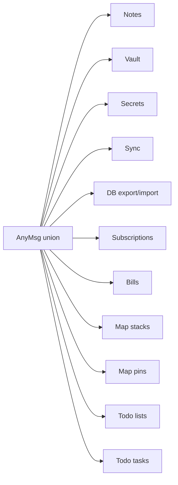
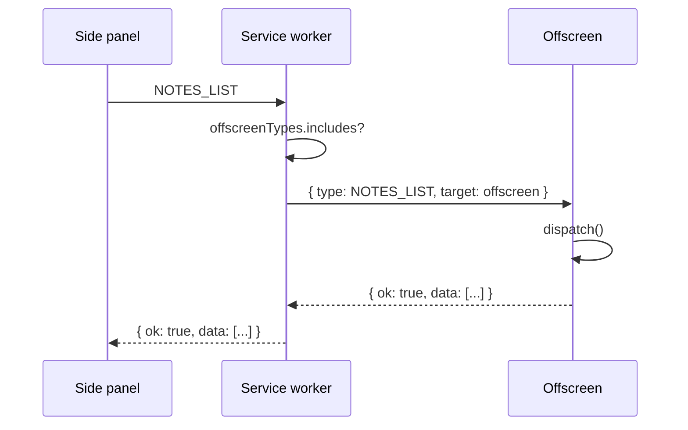

# Message protocol

The Chrome extension's three execution contexts (side panel, service worker, offscreen document) communicate exclusively through `chrome.runtime.sendMessage`. There is no shared memory, no shared module state, and no event bus. Every interaction is a request/response message with a typed shape. This page documents that protocol end to end.

## The Msg/Reply type system

All messages and responses are defined in `chrome-extension/src/shared/messages.ts`. The building blocks are two generic helper types:

```ts
export type Msg<T extends string, P = undefined> = P extends undefined
  ? { type: T }
  : { type: T; payload: P }

export type Reply<D = undefined> = D extends undefined
  ? { ok: boolean; error?: string }
  : { ok: boolean; data?: D; error?: string }
```

`Msg<T, P>` produces a discriminated union member tagged by `type`. When `P` is omitted the message carries no payload (e.g. `VAULT_LOCK`). When `P` is provided the message includes a `payload` field of that shape. `Reply<D>` is the envelope for every response: `ok` is always present, `data` is present only when the call succeeds and the handler has something to return, and `error` is present on failure.

This design means the side panel can `await sendMsg(...)` and always destructure `ok`, `data`, `error` without checking types first.

## The AnyMsg union

Every individual message type is declared as a `type` alias, then combined into a single `AnyMsg` union at the bottom of the file. The offscreen dispatcher and the service worker router both accept `AnyMsg` (or `AnyMsg & { payload?: ... }`) as their input. TypeScript's exhaustiveness checking on the `switch` statement ensures every member of the union is handled.



## Message routing in the service worker

The service worker (`chrome-extension/src/service-worker/index.ts`) is a pure router. It owns no application state except OAuth token caching and Drive file ID persistence. Its `chrome.runtime.onMessage.addListener` does three jobs:

### 1. Forward to offscreen

A hard-coded list `offscreenTypes` enumerates every message type that must reach the offscreen document (database and crypto operations). When such a message arrives, the worker calls `sendToOffscreen(msg)`, which:

1. Ensures an offscreen document exists via `ensureOffscreen()` (checks `chrome.runtime.getContexts`, creates the document with reason `WORKERS` if absent).
2. Sends the message with `target: 'offscreen` appended.
3. Pipes the offscreen's reply back to the original sender via `sendResponse`.

It returns `true` from the listener to keep the message channel open for the async response.



### 2. Handle sync and OAuth directly

Sync messages (`SYNC_PUSH`, `SYNC_PULL`, `SYNC_PULL_CONFIRM`, `SYNC_CONNECT`, `SYNC_STATUS`, `SYNC_FETCH_USERINFO`) are handled **in the service worker**, not forwarded. The worker needs `chrome.identity.getAuthToken` and `fetch` to Google Drive, neither of which is available in the offscreen document. These handlers internally call `sendToOffscreen` for the crypto parts (encrypt the export, decrypt the import) but orchestrate the Drive upload/download themselves. See [cryptography](./crypto.md) and [database](./database.md) for those sub-flows.

### 3. Forward content-script messages

`MAP_PIN_CAPTURE` messages from content scripts are rebroadcast as `MAP_PIN_FROM_PAGE` to the side panel (if open) so the Map Pins view can ingest a captured pin.

## Offscreen dispatch pattern

The offscreen document (`chrome-extension/src/offscreen/main.ts`) registers its message listener **immediately** on script load, before `initDb()` has resolved:

```ts
let ready: Promise<void> = initDb()

chrome.runtime.onMessage.addListener((msg, _sender, sendResponse) => {
  if (msg.target !== 'offscreen') return false
  ready.then(() => dispatch(msg)).then(sendResponse)
  return true
})
```

The `ready` promise gates dispatch: any message that arrives while PGlite is still initialising is queued on the promise chain and processed once the database is ready. This avoids a race where the service worker creates the offscreen document and immediately forwards a message before the DB is up.

The dispatcher (`chrome-extension/src/offscreen/handler.ts`) is a single large `switch` on `msg.type`. Each case casts the payload to its expected shape, calls the appropriate `db.*` or `crypto.*` function, and returns `{ ok: true, data: ... }`. Any thrown error is caught at the top level and returned as `{ ok: false, error: e.message }`. Two message types (`SYNC_PUSH`, `SYNC_PULL`, `SYNC_STATUS`) explicitly return `{ ok: false, error: '... not handled in offscreen' }` because they belong to the service worker.

## All message types by domain

### Vault

| Type            | Payload                              | Handled in | Purpose |
|-----------------|--------------------------------------|------------|---------|
| `VAULT_UNLOCK`  | `{ password: string; salt: number[] }` | Offscreen  | Derive AES-GCM key from password + salt, start auto-lock timer |
| `VAULT_LOCK`    | none                                 | Offscreen  | Zero the in-memory key, clear timer |
| `VAULT_STATUS`  | none                                 | Offscreen  | Return `{ locked: boolean; expiresAt?: number }` |

### Notes

| Type            | Payload                                                                   | Returns |
|-----------------|---------------------------------------------------------------------------|---------|
| `NOTES_LIST`    | `{ query?: string; tag?: string }` (optional)                             | `Note[]` |
| `NOTES_GET`     | `{ id: string }`                                                          | `Note` |
| `NOTES_CREATE`  | `{ title; content; tags?; image_data? }`                                  | `Note` |
| `NOTES_UPDATE`  | `{ id; title?; content?; tags?; image_data? }`                            | `Note` |
| `NOTES_DELETE`  | `{ id: string }`                                                          | void |

### Secrets

| Type              | Payload                                          | Returns |
|-------------------|--------------------------------------------------|---------|
| `SECRETS_LIST`    | `{ query?; tag? }` (optional)                    | `SecretMeta[]` (no ciphertext) |
| `SECRETS_GET`     | `{ id: string }`                                 | `SecretValue` (decrypted) |
| `SECRETS_CREATE`  | `{ label; value; tags? }`                        | `{ id, label, tags }` |
| `SECRETS_UPDATE`  | `{ id; label?; value?; tags? }`                  | `{ id, label, tags }` |
| `SECRETS_DELETE`  | `{ id: string }`                                 | void |

`SECRETS_GET`, `SECRETS_CREATE`, and `SECRETS_UPDATE` all call `resetLockTimer` after touching the key, extending the auto-lock window on activity.

### Subscriptions and bills

| Type                | Payload                                                                       | Returns |
|---------------------|-------------------------------------------------------------------------------|---------|
| `SUBS_LIST`         | `{ query?; tag? }` (optional)                                                 | `Subscription[]` |
| `SUBS_GET`          | `{ id }`                                                                      | `Subscription` |
| `SUBS_CREATE`       | `{ name; amount; currency; cycle; start_date; tags; notes; active? }`         | `Subscription` |
| `SUBS_UPDATE`       | `{ id; name?; amount?; currency?; cycle?; start_date?; tags?; notes?; active? }` | `Subscription` |
| `SUBS_DELETE`       | `{ id }`                                                                      | void |
| `BILLS_LIST_MONTH`  | `{ year; month }`                                                             | `Bill[]` |
| `BILLS_LIST_SUB`    | `{ sub_id }`                                                                  | `Bill[]` |
| `BILLS_UPSERT`      | `{ sub_id; year; month; amount; currency; notes? }`                           | `Bill` |
| `BILLS_DELETE`      | `{ sub_id; year; month }`                                                     | void |
| `BILLS_GET_ALL`     | none                                                                          | `Bill[]` |

### Todo lists and tasks

| Type                  | Payload                                                                       | Returns |
|-----------------------|-------------------------------------------------------------------------------|---------|
| `TODO_LISTS_LIST`     | none                                                                          | `TodoList[]` |
| `TODO_LISTS_CREATE`   | `{ name; color; icon? }`                                                      | `TodoList` |
| `TODO_LISTS_UPDATE`   | `{ id; name?; color?; icon? }`                                                | `TodoList` |
| `TODO_LISTS_DELETE`   | `{ id }`                                                                      | void |
| `TODO_TASKS_LIST`     | `{ list_id }`                                                                 | `TodoTask[]` |
| `TODO_TASKS_CREATE`   | `{ list_id; title; note; priority; due_date; recurrence }`                    | `TodoTask` |
| `TODO_TASKS_UPDATE`   | `{ id; title?; note?; priority?; due_date?; recurrence?; done? }`             | `TodoTask` |
| `TODO_TASKS_DELETE`   | `{ id }`                                                                      | void |

### Map stacks and pins

| Type              | Payload                                                                       | Returns |
|-------------------|-------------------------------------------------------------------------------|---------|
| `STACKS_LIST`     | none                                                                          | `MapStack[]` |
| `STACKS_CREATE`   | `{ name; color; icon? }`                                                      | `MapStack` |
| `STACKS_UPDATE`   | `{ id; name?; color?; icon? }`                                                | `MapStack` |
| `STACKS_DELETE`   | `{ id }`                                                                      | void |
| `PINS_LIST`       | `{ stack_id }`                                                                | `MapPin[]` |
| `PINS_CREATE`     | `{ stack_id; label; lat; lng; url; note; priority?; category?; rating?; review_note? }` | `MapPin` |
| `PINS_UPDATE`     | `{ id; label?; note?; priority?; category?; rating?; review_note? }`         | `MapPin` |
| `PINS_DELETE`     | `{ id }`                                                                      | void |

### Sync

| Type                     | Payload                                              | Handled in | Purpose |
|--------------------------|------------------------------------------------------|------------|---------|
| `SYNC_PUSH`              | none                                                 | SW         | Export DB, encrypt, upload to Drive |
| `SYNC_PULL`              | none                                                 | SW         | Download from Drive, decrypt, import (may request password) |
| `SYNC_PULL_CONFIRM`      | `{ password: string }`                               | SW         | Re-derive key with backup salt and finish import |
| `SYNC_STATUS`            | none                                                 | SW         | Return `{ connected; lastSync; email; avatar }` |
| `SYNC_CONNECT`           | none                                                 | SW         | Run interactive OAuth, save email/avatar |
| `SYNC_FETCH_USERINFO`    | none                                                 | SW         | Refresh and persist user info from userinfo endpoint |
| `SYNC_ENCRYPT`           | `{ plaintext: string }`                              | Offscreen  | Encrypt arbitrary plaintext with current vault key |
| `SYNC_DECRYPT`           | `{ ciphertext; iv }`                                 | Offscreen  | Decrypt with current vault key |
| `SYNC_DECRYPT_WITH_SALT` | `{ ciphertext; iv; salt; password }`                 | Offscreen  | Re-derive key from backup salt + password, decrypt (never caches key) |

### Database export/import

| Type         | Payload                                                                                                                               | Returns |
|--------------|---------------------------------------------------------------------------------------------------------------------------------------|---------|
| `DB_EXPORT`  | none                                                                                                                                  | `{ notes; secrets; subscriptions; bills; mapStacks; mapPins; todoLists; todoTasks }` |
| `DB_IMPORT`  | `{ notes; secrets; subscriptions?; bills?; mapStacks?; mapPins?; todoLists?; todoTasks? }`                                           | `{ notesUpdated; secretsAdded; subsUpdated; billsUpdated; mapsUpdated; todosUpdated }` |

These are internal messages used by the service worker's sync handlers. `DB_IMPORT` accepts optional arrays for the newer entity types so older backups (which predate subscriptions, bills, maps, or todos) still import cleanly. See [database](./database.md) for the conflict-resolution logic.

## Related pages

- [Chrome extension](../applications/chrome-extension.md) — how the side panel uses `sendMsg` to talk through this protocol.
- [Cryptography](./crypto.md) — what the vault and sync-encrypt messages actually do.
- [Database](./database.md) — what the CRUD messages do to PGlite.
- [Data models](../reference/data-models.md) — the shapes returned by these messages.
